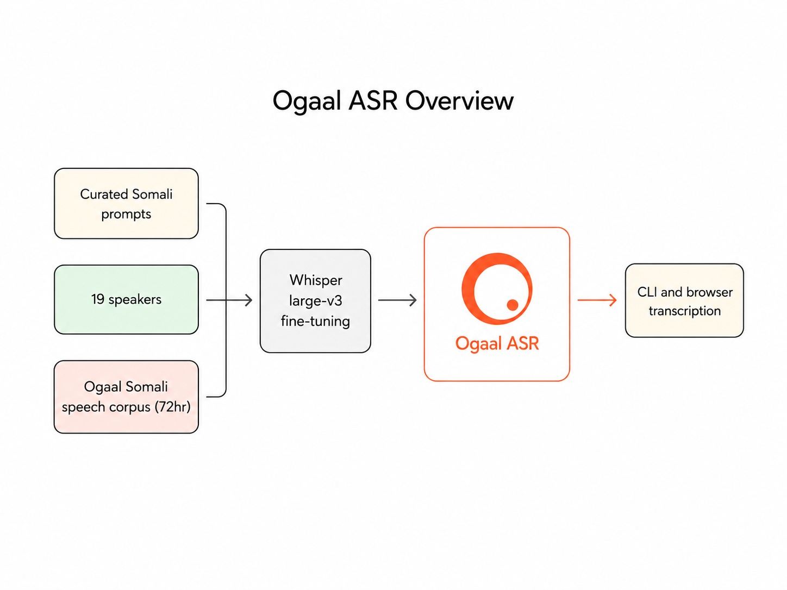

# Ogaal ASR Technical Book

## 1. Summary

`Ogaal ASR` is a Somali automatic speech recognition model released by Ogaal Labs.

It is a fine-tuned `openai/whisper-large-v3` checkpoint trained on roughly `72.1` hours of Somali speech and packaged for practical Somali transcription workflows.

## 2. Ogaal Labs Positioning

Ogaal Labs focuses on local datasets and practical AI tools for Somali and African communities. The purpose of this release is straightforward:

- build useful Somali speech technology
- strengthen locally grounded Somali AI infrastructure
- release a model that developers can run immediately through a CLI or browser demo

`Ogaal ASR` was intentionally trained for Somali speech recognition. English was not part of the training objective for this release.

## 3. Training Data

The training run used:

- train rows: `39604`
- validation rows: `429`
- test rows: `428`
- train hours: `72.1`
- validation hours: `0.557`
- test hours: `0.574`

A private Ogaal Labs collection pipeline contributed a core part of this effort through roughly `5,000` curated prompts recorded by `19` speakers across varied genders, accents, and speaking styles.

This collection approach helped improve speaker diversity while keeping the release tightly focused on Somali transcription.

## 4. Model And Training Setup

- base model: `openai/whisper-large-v3`
- task: `transcribe`
- language prefix: `so`
- direct fine-tuning: `false`
- epochs: `6.0`
- learning rate: `0.0001`
- batch size per device: `1`
- gradient accumulation steps: `8`
- gradient checkpointing: `true`

This run was released as a full fine-tuned model rather than a LoRA adapter.

## 5. Core Somali Results

Held-out validation:

- WER: `0.2166`
- CER: `0.1054`

Held-out Somali test:

- WER: `0.2278`
- CER: `0.1186`

These are the primary public metrics for the release.

## 6. Inference Workflow

The public code release includes:

- a file and folder inference CLI
- a local browser demo for microphone recording or audio upload
- chunked inference for longer audio

The browser demo is not live streaming. The workflow is:

1. record
2. stop
3. transcribe

## 7. Public Release Wording

Use wording close to:

> A Somali automatic speech recognition model from Ogaal Labs, built by fine-tuning Whisper large-v3 on roughly `72.1` hours of Somali speech for practical Somali transcription workflows.

This phrasing keeps the release aligned with the actual training objective and the intended product use.

## 8. Ogaal Labs

Ogaal Labs website:

- `https://ogaallabs.com/`
